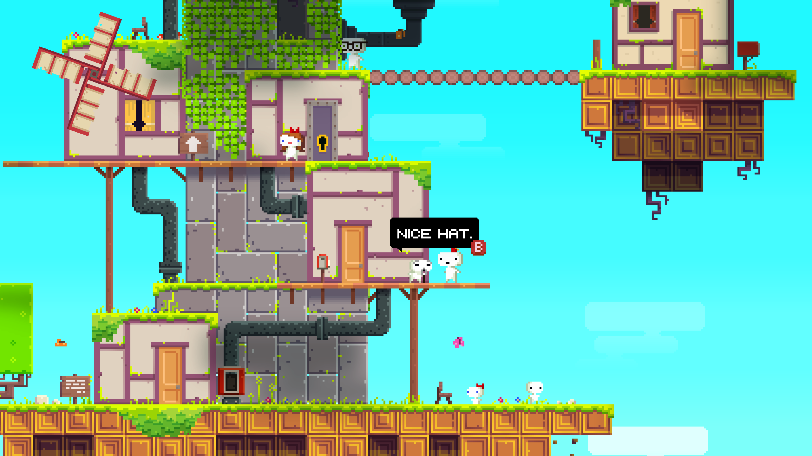
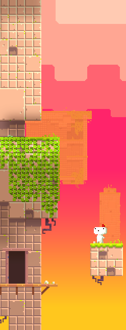
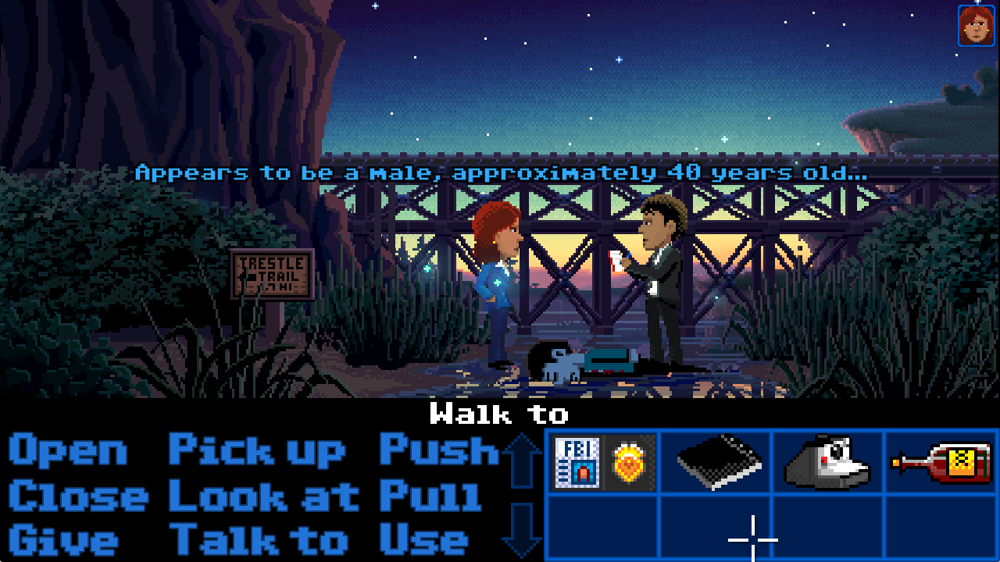

# Palettes

Some palettes I ❤️. <https://github.com/netgusto/palettes>

## Fez grass

From the amazing [Fez](https://store.steampowered.com/app/224760/FEZ/).

#46F9FF

#5CFEFF

#7DFEFA

#975174

#E0D2C0

#454450

#625F60

#899190

#F74CB3

#F9C30E

#CF1107

#6FE104

#DAFD01

#A6D439

#56B42C

#7CCA2E

#3B9C29

#63B62C

#2A801A

#539B21

#E3B027

#CC763B

#91473F

#8F6321

#72442A

#46202E

## Fez sunset

From the wonderful [Fez](https://store.steampowered.com/app/224760/FEZ/).

#FBCAB2

#FAA592

#F96472

#F9246A

#F9425C

#F97046

#F99735

#F9C71F

#E2FD0E

#AFD80E

#7BB10E

#FABB96

#BF8B70

#916760

#A5D0FF

#599BFF

#3D75FD

#284CA3

## Thimbleweed Park sunset

From the captivating [Thimbleweed Park](https://thimbleweedpark.com/).

#170D47

#1C1B56

#1C2361

#1C2E6A

#213876

#254781

#28598A

#326D97

#3D809F

#4E91A1

#5F9FA7

#71B0AD

#93CDAB

#C3E0AD

#E4E8A6

#F7EB96

#FFE48D

#FFCB83

#FEC07A

#EB948E

#D28190

#B47890

